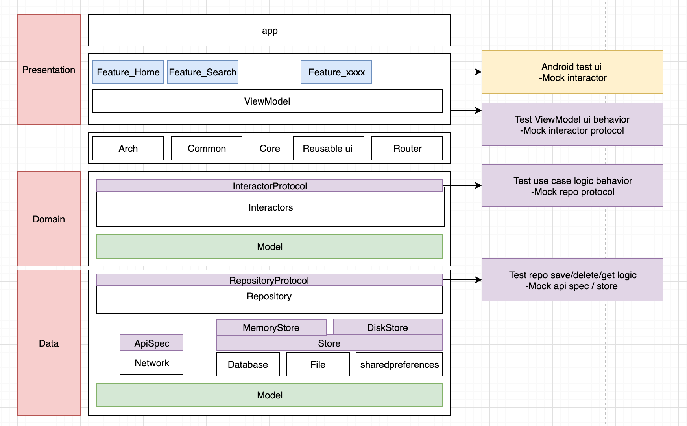

## Modular Clean Architecture Principle

## Project Overview

This project is flow [Build a Modular Android App Architecture(Google I/O'19)](https://www.youtube.com/watch?v=PZBg5DIzNww), the following are the project goal of features  
- Modularization: ensure each page has own responsibility and can be split apk 
- Clean Architecture: 
    - Presentation layer: response for rendering ui and will follow MVVM pattern
    - Domain layer: response for different use case business logic 
    - Data layer:
        - Network: response for network connection to get raw data from server 
        - Database: response for data store if necessary
        - Store 
            - Cache 
           

## Project Description

First of all, I would like to show height level architecture of this app For achieving The separation of concerns 

- ## Presentation layer 
    Follow the app modularization 
    I'm gonna separate whole app by page, so each page is a feature model and it contains Activity/Fragment and ViewModel which will only handle rendering views and will follow MVVM pattern
    - ex. feature_home: represent home activity witch contains several different pages
    - ex. feature_info: it just a sample show maybe will have drama detail page in the feature

- ## Domain layer 
    - With the Use Cases that will include all business logic and interact between Data and Presentation layer 

- ## Data layer 
    - Currently contains Network and response for server request
    - Feature plan : Database , File , Sharedpreferences
  
- ## Core
     Response for provide basic/reusable stuff/utils/common  
     - base arch ex. BaseActivity/BaseFragment/BaseViewModel.
        
- ## Router
     Because separate whole page to achieve single responsibility for each model, witch mean feature model don't know each other.So the router is response fo define page navigation.

- ## Features
     - Unit test
     - Define usecase 
     - Store arch 

### Used libraries: ###
- [RxJava2](https://github.com/ReactiveX/RxJava)
- [RxAndroid](https://github.com/ReactiveX/RxAndroid)
- [Retrofit2](https://github.com/square/retrofit)
- [Android architecture components](https://developer.android.com/topic/libraries/architecture/index.html)
- [Glide](https://github.com/bumptech/glide)
- [Coroutines](https://github.com/Kotlin/kotlinx.coroutinese)
- [Koin](https://github.com/InsertKoinIO/koin)

